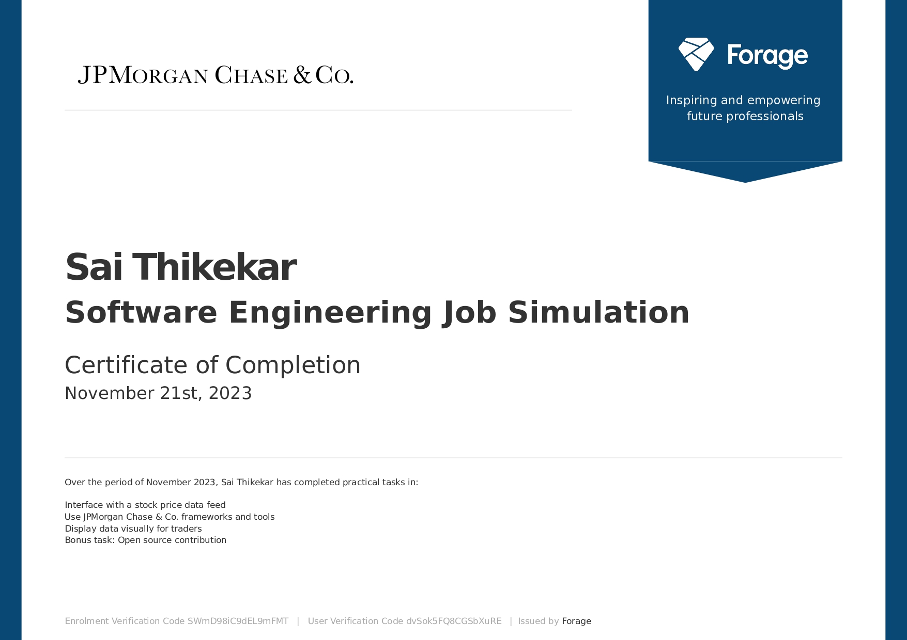

# JP Morgan and Chase : Software Engineering Job Simulation

Completed the JPMorgan Chase & Co. Software Engineering Virtual Experience offered by Forage, consisting of real-world simulated tasks that mirror software engineering challenges at JPMC. The program involved:

- Interfacing with live stock price data feeds to build a data-driven system using Python, setting up a development environment, and understanding engineering workflows.
- Utilizing JPMorgan’s open source library, Perspective, leveraging React and TypeScript for data visualization applications aimed at traders.
- Creating interactive, live-updating visual dashboards that display stock market data clearly to support trading decisions.
- Optionally contributing to open-source projects, enhancing collaboration and code contribution skills.

This experience provided a strong foundation in full-stack development, financial data analysis, and technical communication. It fostered a deep interest in financial technology and hands-on problem solving within a cutting-edge, tech-driven banking environment. The simulation helped to solidify practical skills and sparked enthusiasm for exploring advanced data visualization and software engineering techniques further.

